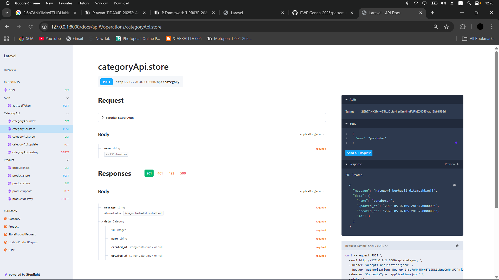
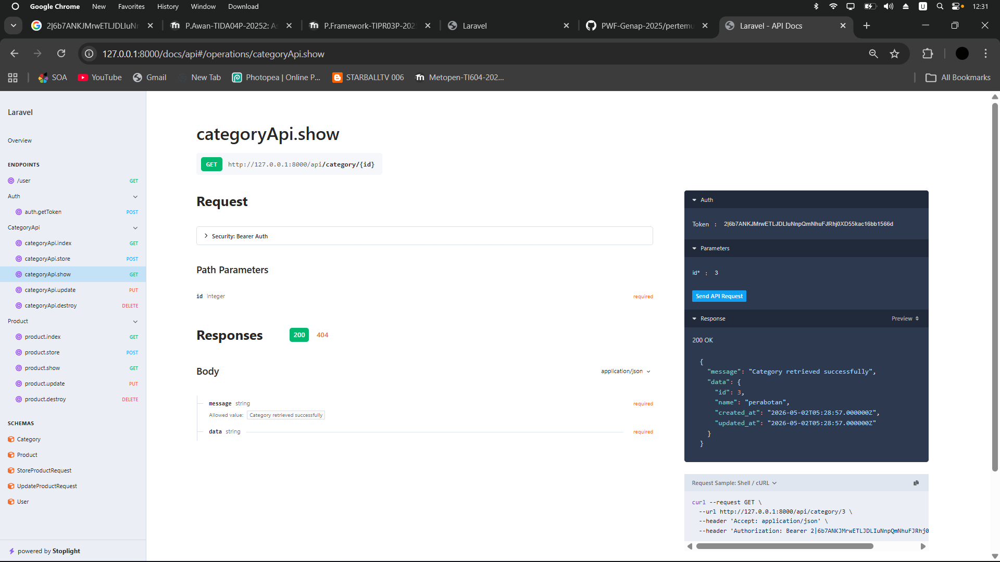
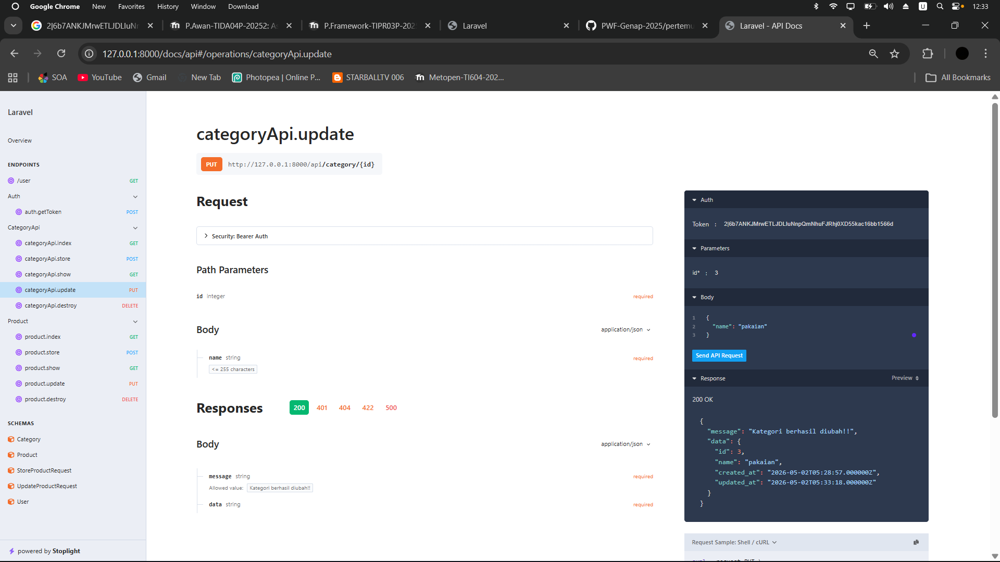
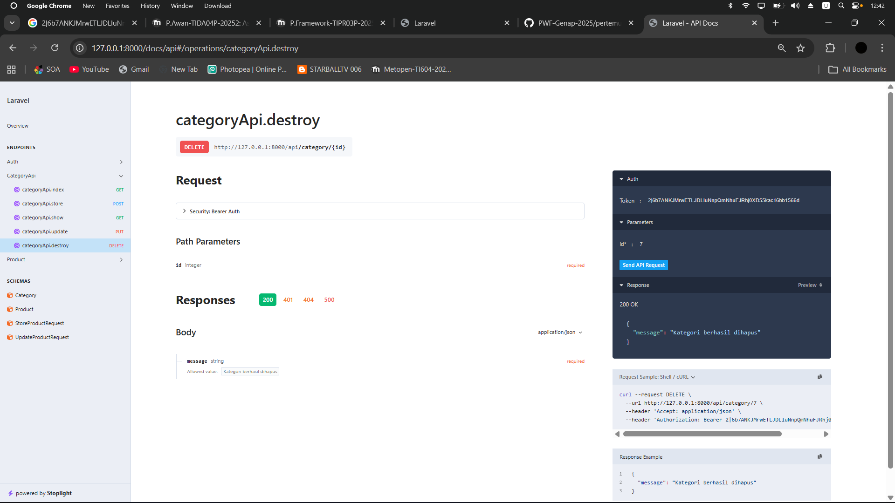

# Praktikum 9 - Laravel CRUD API & Sanctum

**Nama**  : Irfan Afifuddin  
**NIM**   : 20230140187  
**Kelas** : B  

## 1. GET TOKEN

## 2. GET PRODUCT

## 3. UPDATE PRODUCT

## 4. DELETE PRODUCT

